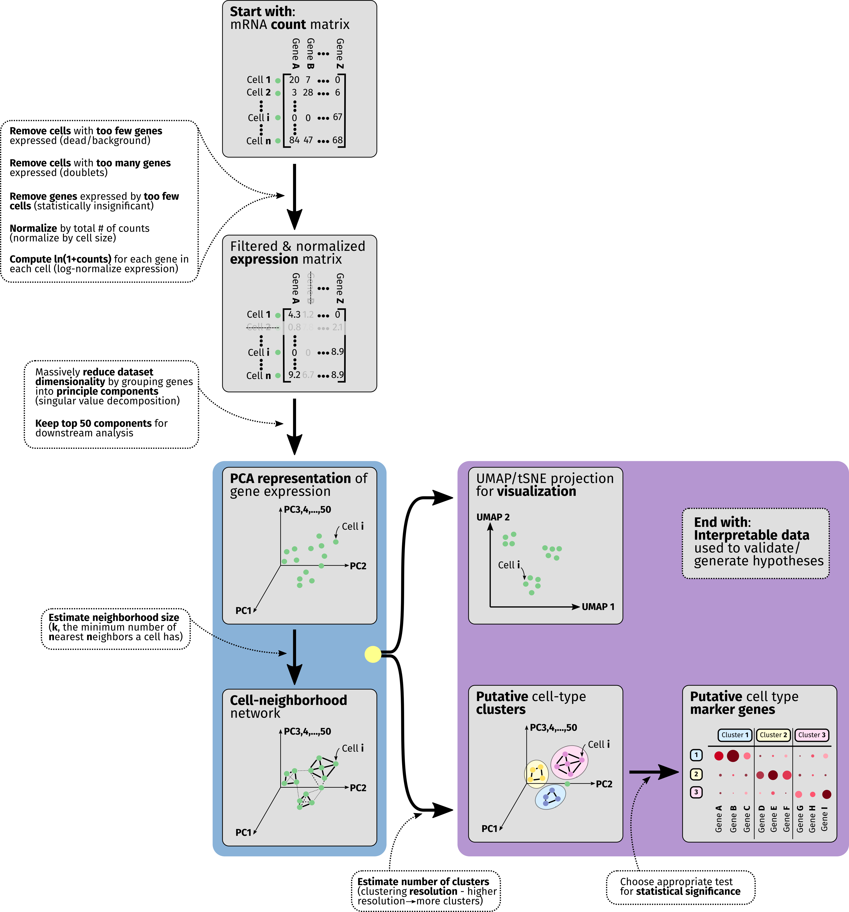

.. _overview:

Overview of scRNA-seq workflows
================================

Analysis of data from single-cell RNA-seq is a large and rapidly-maturing field. Though many different pipelines exist for taking scRNA-seq data and extracting actionable information it, we hope that this guide can serve as a summary of the most critical components to be aware of as researchers consider analyzing their data with MiCV. In the overview diagram we depict the flow of operations that nearly all scRNA-seq pipelines have in common. 

------------------

What does the data look like?
*****************************

To start any sort of scRNA-seq analysis, we need to arrange a table (matrix) of mRNA molecule counts for each gene expressed by each cell in the dataset. This table is **large** - typically consisting of thousands of cells (rows/observations) and on the order of 20,000 genes (columns/variables), though the number of genes detected will vary based on organism, sequencing chemistry, and read depth (how many reads were allocated to your sequencing sample). 

------------------------

Quality control filtering
*************************

Though computers today are powerful enough to perform analysis on this entire data table, we can both speed up our analysis and simultaneously de-noise our dataset by doing some **preliminary filtering**. Typically, we remove any "cells" from the table that express very *few* genes, as they are likely either dead cells or sequenced samples that represent background mRNA that was found in the cell suspension. We then remove "cells" that expressed very *many* genes, as they possibly represent doublets - pairs of cells that were captured together and biochemically treated as a single unit. The minimum/maxmimum number of genes here varies from sample to sample for both experimental (chemistry) and biological (cell size/organism) reasons - a good starting point for most analyses is to keep things in the range of [200, 10000] genes per cell. Finally, we remove genes that are only expressed in a very small population of cells, as their expression is rare enough that drawing meaningful statistics from them is likely to prove challenging. 

-----------------

Normalization
*************

After filtering the scRNA-seq data table, two mathematical operations are performed behind the scenes for every data entry in the table. Firstly, the **expression counts are normalized** such that every *cell* has the same *total* number of mRNA counts, to mildly remove any artifacts introduced due to cell size differences. Secondly, we **log-transform every entry** in the table, converting from counts -> ln(1 + counts). This final log-transformed value is often called the **expression** level of the gene for that particular cell, and is used in all downstream analysis. Keep in mind that each increment of 1 in this expression value represents a factor of ~2.7 (*e*) increase in gene expression. 

--------------

Reducing the dimensionality with PCA
************************************

In order to massively reduce the complexity of this data table and contiue to extract out the most *meaningful* information from it, we perform a dimensionality reduction operation known as **Principle Component Analysis (PCA)** on it. In a few words, this technique groups genes into sets of *principle components* that represent important factors in differentiating cells from one another, and uses these components as the basis of the data table instead of the raw gene expression values for each individual gene. In linear algebra an analogous operation is known as *eigenvalue-eigenvector decomposition*. 

---------------------

Going further with neighborhood graphs
**************************************

This re-dimensioned data table is now used to derive a **neighborhood network/graph** for cells in the dataset. Essentially, neighborhood network generation algorithms such as this aim to figure out which cells are "close" to one another and which are far apart in this high-dimensional space - a task that is much harder in 50-dimensional PCA-space than it is in a typical 2D scatter plot. Intuitively we can think of this graph as loosely identifying cells that express similar sets of genes and tying them together.

-------------------

Visualizing and clustering
**************************

We use both the PCA representation of the data table alongside the neighborhood graph to simultaneously do two things - identify **putative cell-type clusters** and generate a 2/3-dimensional **projection** of the data, which attempts to represent the high-dimensional data captured in a scRNA-seq experiment in a low-dimensional plot. Typically, cell-type clusters are represented as colored groups of cells in these low-dimensional projections, but it is important to note that projections like UMAPs and tSNEs are, in most analysis pipelines, used for *visualization* purposes only - not analysis.

------------------

Identifying marker genes
************************

Finally, after grouping cells together into putative subtype clusters, we employ any number of statistical tests to identify **marker genes** that are highly over-represented in each particular cell cluster. This marker gene list is important to interrogate actively, as it can both point to the need to refine cell-type clustering parameters (if many marker genes are shared across groups, for instance) and will often form the basis of follow-on experiments that validate hypotheses generated using scRNA-seq data.