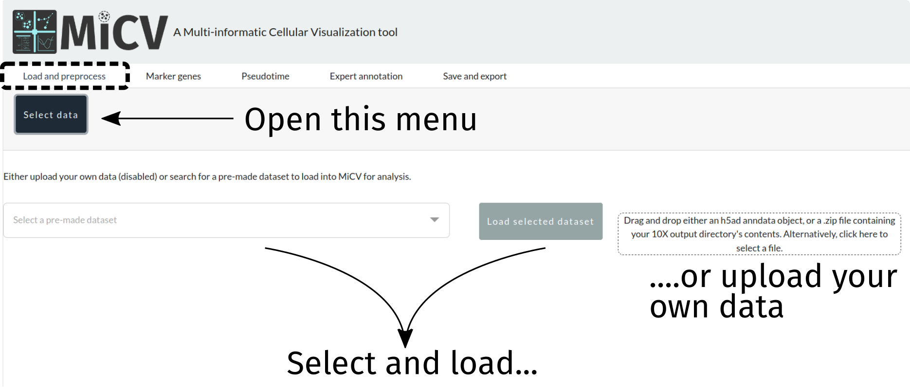
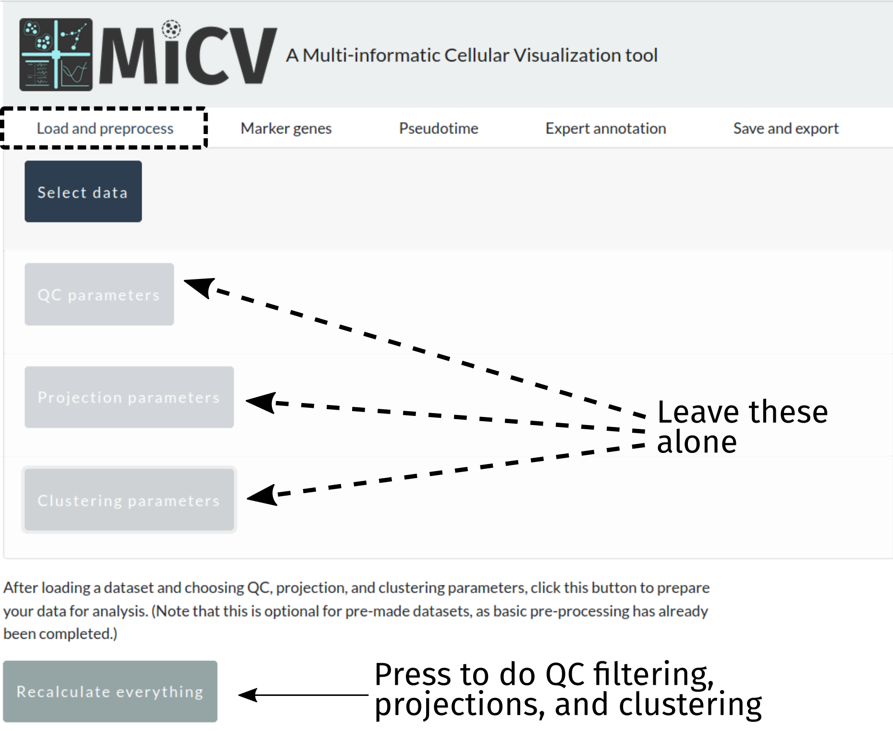
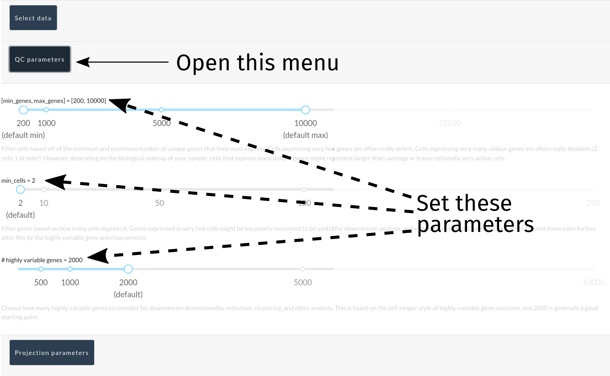
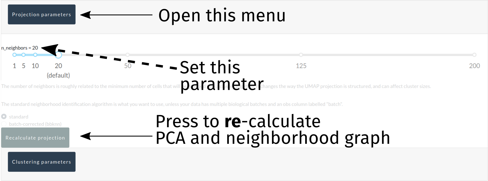
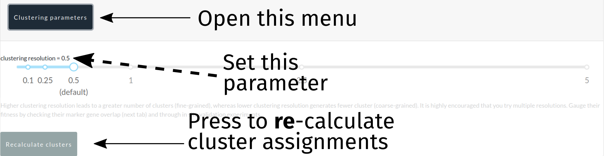
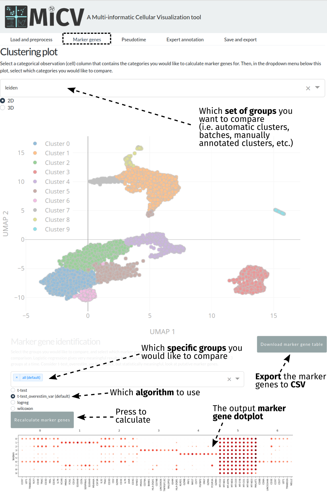
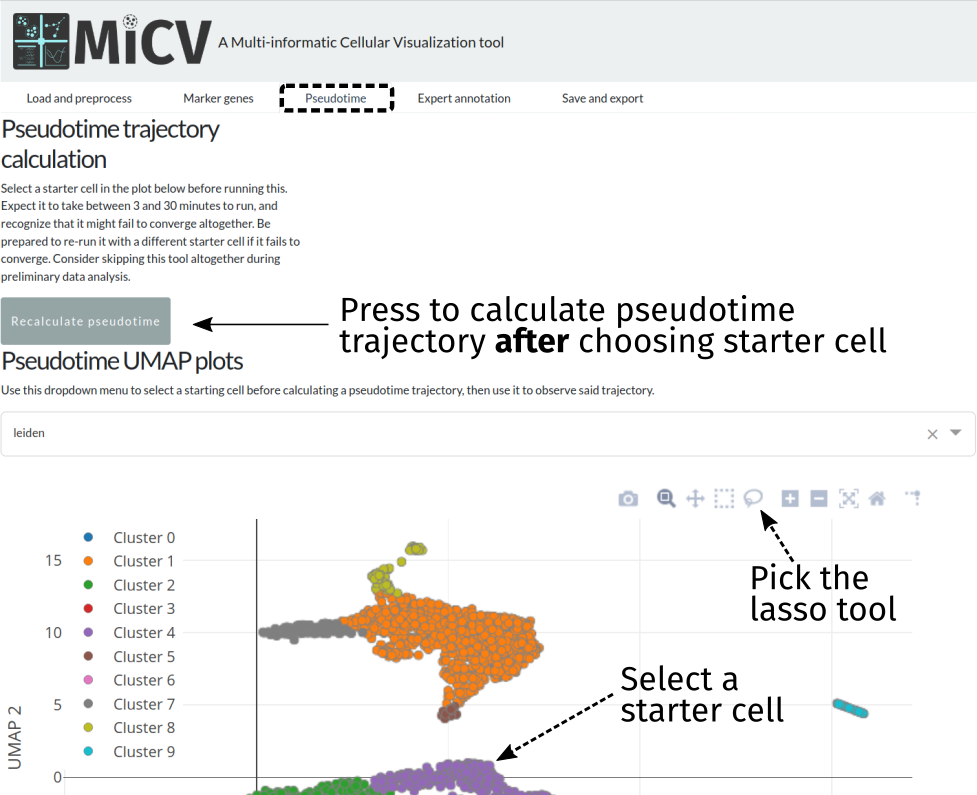
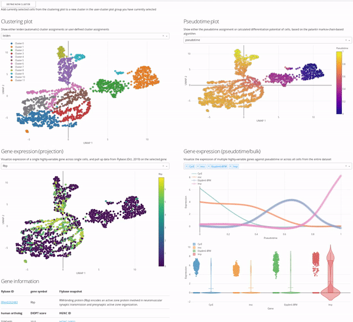
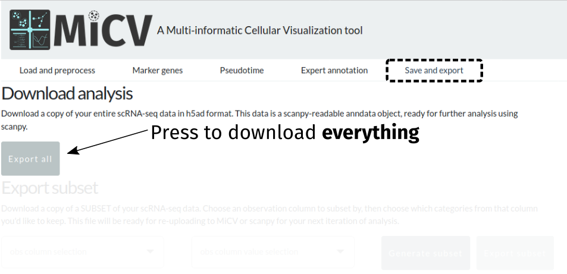
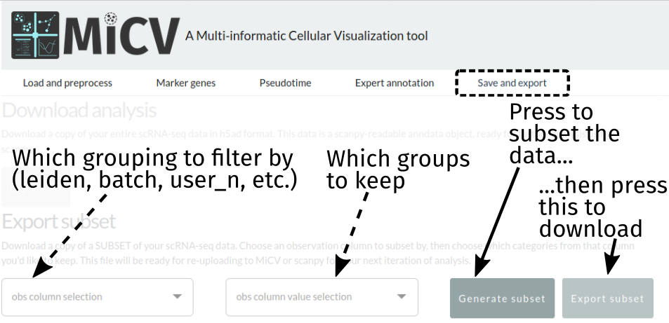

.. _tutorial:

Using MiCV
==========

MiCV aims to provide all of the functionality necessary for taking any raw data table of single-cell mRNA counts and perform all of the steps necessary in a typical scRNA-seq analysis pipeline (see :ref:`overview`). MiCV further provides an interface for performing **interactive annotation** of scRNA-seq datasets, wherein users can search across automatic clustering, specific gene expression profiles, literature summaries of gene functions, and pseudotime expression trends (for datasets where such projections are meaningful). Finally, it enables users to export both specific figures, their entire analyzed datas, as well as subsets of this data, to formats that the can used by others for more advanced analysis and publication preparation. 

------------------

Loading the data
################
To begin, we need to load a dataset. We can either choose a curated dataset from the dropdown list, or upload our own. Currently 2 upload formats are accepted: 

- a flat (i.e. containing no folders) ``zip`` file containing exactly 3 files representing the counts matrix in 10X format (``counts.mtx``, ``barcodes.tsv``, ``genes.tsv``)
- an ``h5ad`` file that stores an already generated scanpy/MiCV-compatible anndata object

------------------

Option 1: Automatic QC and data projection (no-frills)
######################################################
When we designed MiCV we provided what we think are sane defaults for the parameters in the following filtering, projection, and clustering steps. For users doing a first-pass analysis on their dataset, we recommend skipping these panels and pressing the ``recalculate everything`` button to take your data and perform all of the necessary steps to generate interactive UMAP projections of their data with putative cell-type clusters annotated and ready for further analysis. Later, you can come back and took a closer look at those parameters to see if modifications might better inform your analysis.

------------

Option 2: Manual QC/projection parameter assignment
###################################################

Filtering cells/genes
*********************
Next, we need to remove some cells that express too few/too many genes, remove genes expressed in too few cells, and tag the most highly variable genes in the dataset (non-destructively). MiCV provides a toolbar for defining your filtering criteria as you see fit, though **sane defaults are provided** that will provide most users with a good starting point. Note that filtering is permanent, in so far as cells/genes that are removed in these filtering steps cannot be brought back without starting over from the original data. 

Projecting the data
*******************
At this point, the data dimensionality needs to be drastically reduced using PCA, neighborhood graphs, and UMAP projections (for visualization purposes). Currently, only ``k``, the minimum number of neighbors identified in each neighborhood, is a modifiable parameter here, and it can be modified to bias the analysis towards smaller/larger groupings of cells in both the automated cluster identification (below) and UMAP projections. 

A button to re-calculte the PCA, neighborhood graph, and UMAP projections is provided in this interface, and this can be done independently of downstream steps such as automated cluster identification (though, as cluster identification depends on the results of these steps, downstream steps should be redone eventually).

For advanced users who have uploaded anndata objects that represent multiple separate samples requiring batch correction, a radio button for selecting the ``bbknn`` neighborhood graph generation algorithm is provided, and will work so long as your anndata object has an ``obs`` column labelled ``batch``, specifying the batch each cell belongs to. ``bbknn`` will subsequently perform a batch-corrected neighborhood graph generation, and ``k`` will be ignored. This feature will eventually move to its own tab for more advanced data integration, though ``bbknn`` alone will hopefully fulfill the needs of many users. 

Automatic cluster identification
********************************
Putative cell type clusters can be identified automatically using the ``leiden`` algorithm, a re-implementation of the popular ``louvain`` algorithm. One key parameter is modifiable here: the clustering **resolution**. Higher values will lead to finer-grained (i.e. smaller) clusters, whereas lower values will lead to coarser-grained (i.e. larger) clusters. A button is provided to only recluster the data with new parameters, making rapid testing of many values for the clustering resolution possible.

--------------------

Inspecting data quality with processing plots
#############################################
After either calculating everything with default settings (option 1) or fine-tuning things yourself (option 2) the plots at the bottom of the page will be fully interactable. The left-most plot is a UMAP projection of the data, with overlays for either automatic cell clustering (leiden clustering) or the number of genes, number of UMIs (mRNA counts), or ln(number of UMIs + 1). The left-most plot displays similar information but in a violin plot format so that the *distribution* of gene and UMI counts can be easily observed. 

Both of these plots are fully interactable, in that they can be zoomed, panned, and exported. In addition, the violin plot will show statistics about the distribution of gene/UMI counts when the mouse is hovered over it. 

We recommend that you use the UMAP and QC violin plots to help fine-tune the processing parameters used in this portion of the analysis pipeline. Play with different values for gene count cutoffs to see how the distribution of cells changes, or change the number of neighbors (k) in the projection settings to change how cells are laid out in the final UMAP visualization plots! 

.. image:: images/MiCV_tutorial_processing_plots.png
  :width: 1000
  :alt: projecting the data

------------------

Identifying marker genes
########################
The marker genes tab can be accessed after projecting your data and identifying some clusters to compare. Typically, these will be the automatically identified clusters (leiden) that represent putative cell types; however, batches, manually annotated clusters, and any *categorical* column in the anndata ``obs`` dataframe can be used to perform marker gene analysis. 

In order to identify marker genes, we first need to bring up the set of groups/categories we want to compare - we do this using the dropdown menu at the top of the page, which will update the UMAP projection plot beneath for your reference.

Scrolling down the page, MiCV provides an interface to select specific subgroups within that larger set of groups, or an option to select all groups (a typical default). Selecting the groups you would like to compare and the algorithm you would like to use for marker gene identification (the default is a good starting point), we can now press the ``Recalculate marker genes`` button to generate a dotplot representing both the mean expression level of, and number of cells expressing, each putative marker gene for each cluster in the comparison. This plot can be downloaded as a ``png`` by right-clicking and selecting ``save image`` (or something similar - browser dependent). Though these plots are useful, they do not show *all* of the marker genes identified - the top 100 for each cluster can be exported using the ``Download marker gene table`` button for further analysis. 

------------------

Calculating a pseudotime trajectory (optional)
##############################################
MiCV uses a python package called ``palantir`` for inferring a pseudotime trajectory for your data. Currently, the only requirement to use this feature is the selection of a **starter cell**, done using the lasso tool on the UMAP plot in the pseudotime tab. If more than one cell is selected (common, if circling a small group of cells in the region you believe your pseudotime trajectory should start), a random single cell from that group will be used as the starting point. 

Pressing the ``Recalculate pseudotime`` button after selecting a starter cell will initiate a **long** set of calculations that will result in the generation of:

- A **pseudotime assignment** for each cell, in the range of [0,1], with 0 being cells close to the starter cell along the pseudotimeline, and 1 being cells far away along the pseudotimeline
- A set of **branch probabilities** for each cell, in the range of [0,1], with high probability meaning that any given cell is very likely to be a member of that specific branch
- A **differentiation potential** estimate for each cell, in the range of [0,1], that aims to capture the potential for cells in the pseudotime trajectory to "differentiate" into different cells (i.e. traverse down through different terminal branches in the pseudotime trajectory)

This pseudotime calculation may fail, and if that is the case it is recommended that you choose a different starter cell or simply retry the calculation, as the algorithms that underlie this calculation do employ some random numbers and are not guaranteed to converge under all circumstances.

Likewise, not all datasets have a biologically relevant pseudotime to assign, though one can "mathematically" be calculated. For example, a mixed population of *terminally differentiated cells* alone likely has no meaningful pseudotime trajectory assignment. Generally, pseudotime trajectory inference is used on datasets that include cells from all points along a **differentiation process**. If your dataset contains stem cells, precursors, maturing cells, and terminally differentiated cells, then a pseudotime assignment will likely prove immensely valuable in your data analysis!  

Finally, this calculation will take quite a bit of time to complete (on the order of 3-30 minutes), growing with dataset size. Please be patient!

-------------------

Interactive data exploration
############################

In the MiCV analysis "pipeline", interactive data exploration and annotation by experts is inarguably a critical, if not the *most critical*, component. In this case, expert is **you**, as you know more about your cells, how they were captured, and what they represent, than anyone else. As such, the ``expert annotation`` tab in MiCV enables you (the expert) to view multiple aspects of your bioinformatic analysis in a single page and integrate any and all of these informatics together to manually annotate cell-type clusters to your liking. 

The page is broken down logically into 4 main quadrants (represented in the MiCV logo):

- Top-left: a master UMAP projection overlaid with either the automated (leiden) clustering result or any of your manual annotation (``user_n``)
- Top-right: a UMAP projection overlaid with pseudotime, differentiation potential, or branch probabilities from your pseudotime trajectory inference, if previously calculated
- Bottom-left: an expression UMAP projection with gene drop-down menus that enable an interactive view of the expression dynamics of specific genes across your dataset. A table beneath this plot is tied to the single-gene dropdown menu and pulls gene summaries and literature references related to your selected gene for reference and aid in interpretation.
- Bottom-right: a line-plot that shows the fitted gene expression trend for specific genes across pseudotime (if previously calculated), and a violin/scatter plot beneath it that shows the distribution of expression values for these genes across all cells in the dataset

The top-left master plot is filterable on its own (you can select specific cells in it using the lasso tool), however the real power in this page comes from the fact that this plot is **cross-filterable**, i.e. you can select cells in *any* of the other plots and the intersection of these selected cells will be the only cells selected in the master plot. In this way you can use, say, the gene expression trend plot in the bottom right to select a region of pseudotime where a specific gene peaks in expression, and use the gene expression UMAP plot in the bottom left to select a region of cells in the UMAP that are high-expressors for a different gene, and the intersection of these two selections will now be selected in the top-left master plot. 

When you're happy with a set of selections, you can use the ``define new cluster`` button to add a new cluster to your selected annotation group in the top-left master plot (i.e. ``user_0``, ``user_1``, etc.). We encourage you to play around with this interface and report back to us on *how* you use it most effectively, so that we can iterate on our interface design to be more useful and approachable for all users.

-------------------

Data export
###########

After performing your own analysis and annotation, you may wish to export your entire dataset or a subset thereof (for example, a few clusters of interest) to load into ``scanpy``, another analysis software, or even right back into MiCV! The ``save and export`` page provides an interface to do just that, with options to either export everything:

Or export just a subset of cells from the dataset:

Currently, exports are in ``h5ad`` format, which is a single ``hdf5`` file that contains all of the data frames, matrices, and unstructured annotations in the ``anndata`` object used by scanpy. Most other analysis packages have interfaces for reading this format, but we are working to include the option to download in other formats - let us know what you'd like to see, or take a crack at contributing this functionality yourself! 